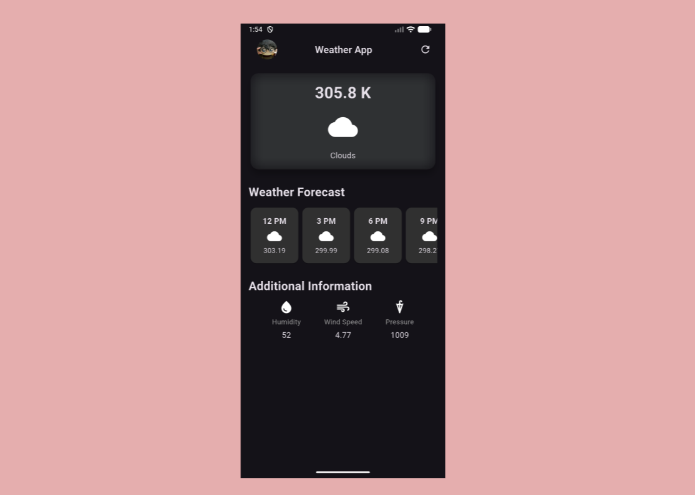

# 🌤️ Weather App Flutter

A simple and lightweight **Flutter Weather App** that displays the **current weather in Phnom Penh, Cambodia**, using live data fetched from a weather API.  
Users can tap the **refresh icon** to get the latest weather updates instantly.

---

## 🚀 Features

- 🌍 **Fixed Location:** Shows current weather for **Phnom Penh, Cambodia**
- 🔄 **Refresh Button:** Tap to fetch updated weather information
- ☁️ **Live Data:** Retrieves real-time weather details (temperature, condition, etc.) from an API

---

## 🧠 How It Works

1. When the app launches, it automatically fetches current weather data for Phnom Penh.  
2. The app sends a **GET request** to a weather API (e.g., [OpenWeatherMap](https://openweathermap.org/api)).  
3. The response (JSON format) is decoded and displayed on the screen.  
4. Users can tap the **refresh icon** to reload and display the latest weather info.

---

## 🧩 Tech Stack

- **Flutter** — Cross-platform framework  
- **Dart** — Programming language for Flutter  
- **HTTP package** — Used to fetch weather data from the API  
- **Weather API** — Provides live weather updates (e.g., OpenWeatherMap)

---

## ⚙️ Setup & Installation

1. **Clone this repository**
   ```bash
   git clone https://github.com/VannetNang/weather-app-flutter.git
   cd weather-app-flutter
